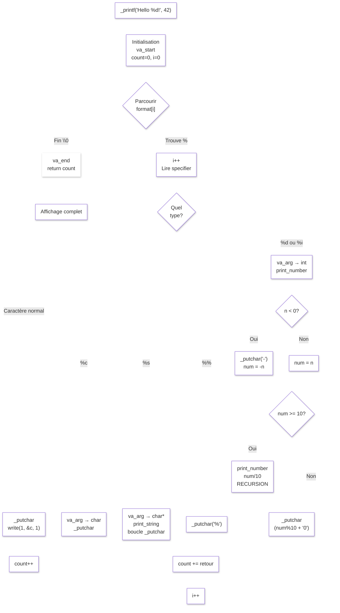

# printf prototype
This project is recreation of the function Printf. 

## Installation
You only need to clone this repositories to be able to use this prototype.  
Then you have to add the library in your own program to use the function.
## Usage
To use this function, it has to respect this syntax:  

_printf("string with or without argument", source of the argument to print (1 per argument))  

exemple:  

_printf("this is an exemple") <-------- without any argument you can print a simple string.  
-> This is an exemple <--------------- so this is the output of the function.  


```
int a = 10  
char b = 'z'  
char *s = "hello"  
  
_printf("%s %c %d", s, b, a) <------- here you can use arguments that you pass after the string (between double quotes "") to variables.  
-> hello z 10  

_printf("%s %c %d", s, b, a) <--------- here you can use arguments that you pass  
-> hello z 10                ---------- after the string (between " ") to variables.
```
  -placeholder exemple with more arguments, custom one and also flags and modifiers-  

## Arguments

| arguments           | declaration | definition                     |   modifiers/flags   |     flag    |            description            | 
| :------------------ | :---------: | :----------------------------- | :-----------------: | :---------: | :-------------------------------- |
| character           |     %c      | print a single character       |       l             | +           | put sign of number (+ or -)       |
| string              |     %s      | print a string                 |       l             | " "         | put space before positive numbers |
| %                   |     %%      | print a simple %               |                     | #           | explicit base print (hex or octal |
| integer             |     %d      | print an integer               | +, " ", -, 0, l, h  | Field width | set minimal width                 |
| integer             |     %i      | print an integer               | +, " ", -, 0, l, h  | Precision   | number of character printed       |
| binary              |     %b      | print a binary                 |                     | 0           | print 0 instead of space          |
| unsigned decimal    |     %u      | print a number                 |    -, 0, l, h       | -           | align to the left                 |
| unsigned octal      |     %o      | print an octet                 |   #, -, 0, l, h     |             |                                   |
| unsigned hexadecimal|     %x      | print a hex number (lowercase) |   #, -, 0, l, h     | modifiers   | description                       |
| unsigned hexadecimal|     %X      | print a hex number (uppercase) |   #, -, 0, l, h     | l           | increase the type size ( ->long)  |
|                     |     %S      | print NPRC* to /x"hex" format  |                     | h           | reduce the type size ( ->short)   |
| pointer             |     %p      | print the adresse of pointer   |                     |
| reverse string      |     %r      | print the string in reverse    |                     |
| Rot13 string        |     %R      | print a converted rot13 string |                     |  

  NPRC* : Non PRintable Character (ex: "\n"  ->\<- is a Non PRintable Character)  
  -Not every arguments is included yet-  
## Flowchart

